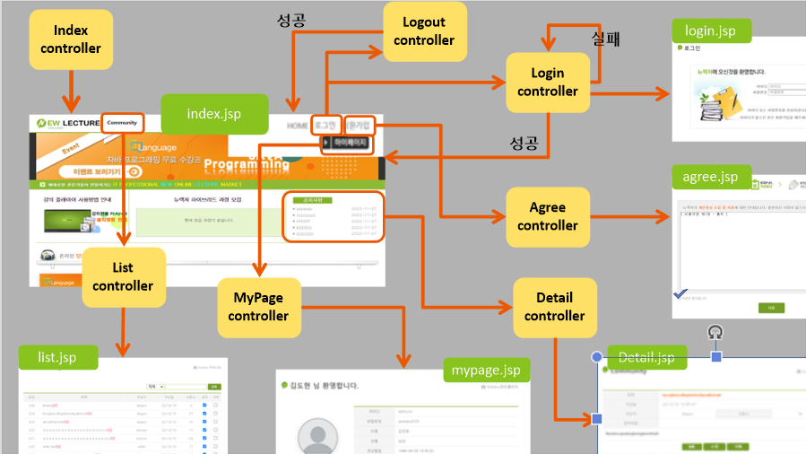
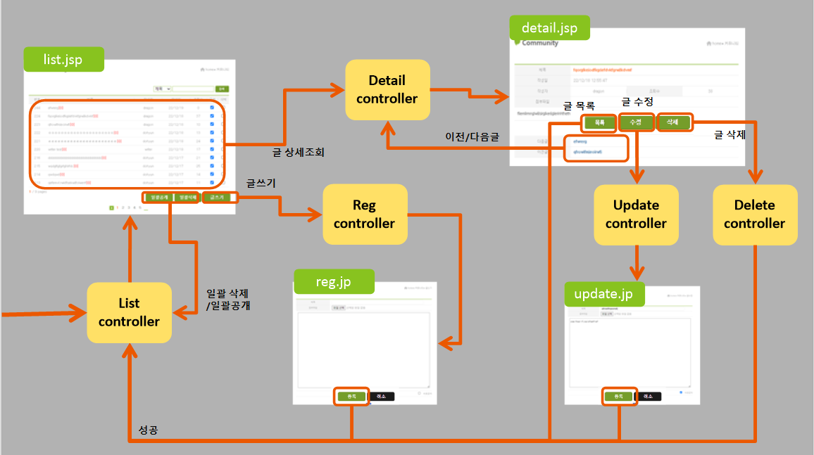
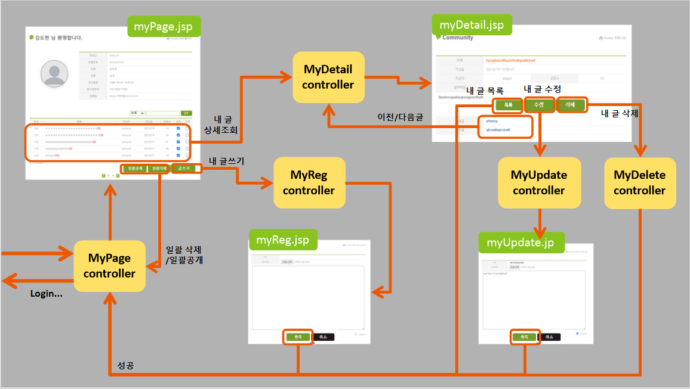
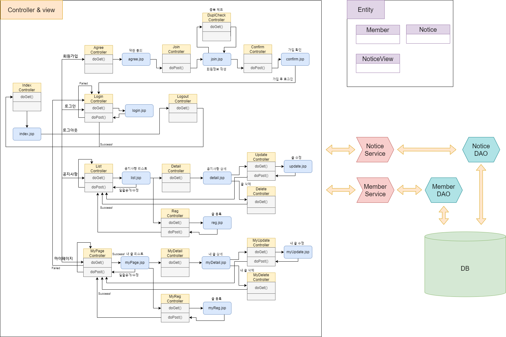
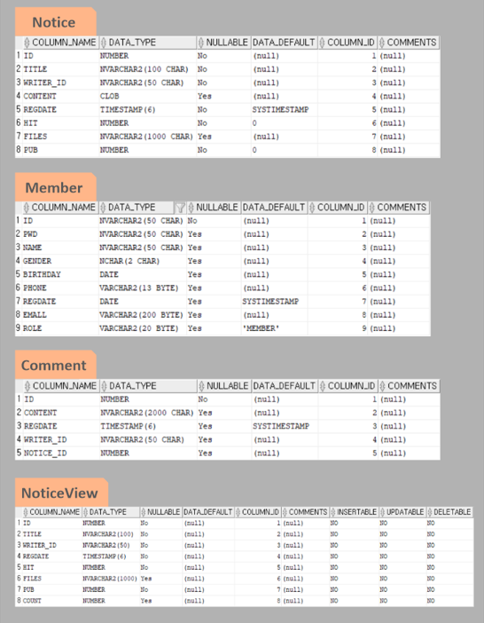

Newlec_Project
------

이 프로젝트는 newlectuer.com 사이트에 있는 html을 jsp로 바꾸어 view를 두고 controller와 업무서비스를 위한 sevlet을 만들고 db와 연결하여 게시판과 서비스를 만들어보는 프로젝트이다.

개발 내용
------

### ■ index - 홈

|구분|Controller|@Anotation|View|Service|
|----|---|---|---|----|
|홈|Index_controller.java|"/index"|index.jsp|NoticeService|

### ■ Notice - 공지사항

|구분|Controller|@Anotation|View|Service|
|----|---|---|---|----|
|Notice-글 상세|Detail_controller.java|"/noticeDetail"|detail.jsp|NoticeService|
|Notice-글 목록|List_controller.java|"/noticeList"|list.jsp|NoticeService|
|Notice-글 등록|Reg_controller.java|"/noticeReg"|reg.jsp|NoticeService|
|Notice-글 수정|Update_controller.java|"/noticeUpdate"|update.jsp|NoticeService|
|Notice-글 삭제|Delete_controller.java|"/noticeDelete"|....|NoticeService|

### ■ Mypage - 마이페이지

|구분|Controller|@Anotation|View|Service|
|----|---|---|---|----|
|Mypage-내 글 목록|MyPage_controller.java|"/memberMyPage"|myPage.jsp|NoticeService|
|Mypage-내 글 상세|MyDetail_controller.java|"/memberMyDetail"|myDetail.jsp|NoticeService|
|Mypage-내 글 등록|MyReg_controller.java|"/memberMyReg"|myReg.jsp|NoticeService|
|Mypage-내 글 수정|MyUpdate_controller.java|"/memberMyUpdate"|myUpdate.jsp|NoticeService|
|Mypage-내 글 삭제|MyDelete_controller.java|"/memberMyDelete"|....|NoticeService|

### ■ Member - 회원

|구분|Controller|@Anotation|View|Service|
|----|---|---|---|----|
|Member-가입동의|Agree_controller.java|"/memberAgree"|agree.jsp|MemberService|
|Member-회원정보등록|Join_controller.java|"/memberJoin"|join.jsp|MemberService|
|Member-가입확인|Confirm_controller.java|"/memberConfirm"|confirm.jsp|MemberService|
|Member-중복체크|Dupl_check_controller.java|"/memberDupl"|....|MemberService|
|Member-로그인|Login_controller.java|"/memberLogin"|login.jsp|MemberService|
|Member-로그아웃|Logout_controller.java|"/memberLogout"|....|MemberService|

### ■ 전체 구성도

### ■ DB 테이블 및 뷰

### ■ 자세한 내용..

[project1]](https://ehgus5825.github.io/java-web/JSP-06/)
[project2]](https://ehgus5825.github.io/java-web/JSP-07/)

